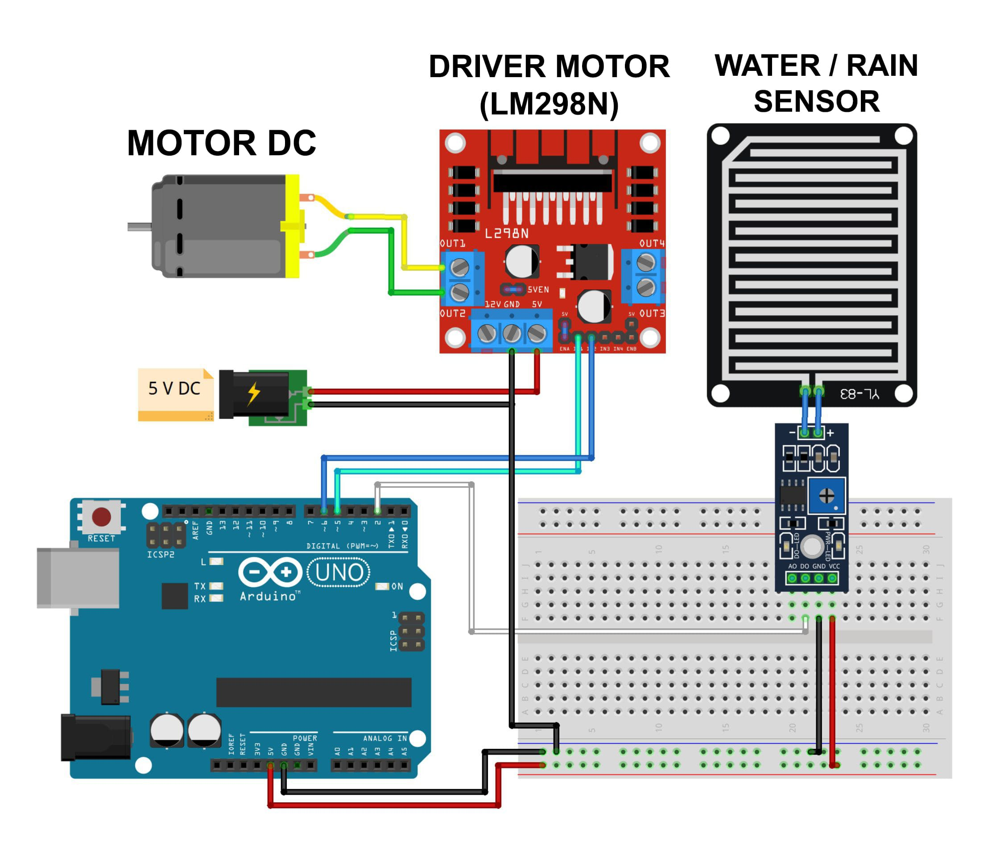

# Automatic Clothes with Rain Sensor (Weather-Responsive Motor Control)

## Overview

This project controls a motor based on weather conditions detected by a sensor. It uses an Arduino to manage the state of the motor depending on whether the sensor detects a specific condition (e.g., rain).

## Components

- Arduino IDE or Text Editors examples: VS Code;
- Arduino board (e.g., Arduino Uno) = 1 Unit;
- Driver Motor (Type: LM298N) = 1 Unit;
- Motor DC = 1 Unit;
- Sensor (e.g., rain sensor / water sensor) = 1 Unit;
- Adapter 5 VDC;
- Project Board / BreadBoard = 1 Unit;
- Connecting wires

# Schematic:

- Below you can see a schematic image to facilitate the wiring of cables from the microcontroller to devices, both input and output sensors:



## Circuit Diagram

- Connect the sensor to pin D2 (D0 Sensor Rain) of the Arduino.
- Connect the motor to pins D5 (motor_maju) and D6 (motor_mundur) of the Arduino.

## Work steps

- Prepare the tools and materials to be used.
- Carry out the wiring process using Figure schematic of the above circuit.
- Open the Arduino IDE software that has been installed on laptop/computer.
- Type the sketch program on the Arduino IDE page.
- Carry out the program uploading process.

## Code Explanation

```cpp
#define Shujan 2
#define motor_maju 5
#define motor_mundur 6

bool cuaca = false;

void setup() {
  pinMode(Shujan, INPUT);
  pinMode(motor_maju, OUTPUT);
  pinMode(motor_mundur, OUTPUT);
}

void loop() {
  int air = digitalRead(Shujan);

  if (air == LOW && cuaca == false){
    digitalWrite(motor_maju, HIGH);
    digitalWrite(motor_mundur, LOW);
    delay(150);
    cuaca = true;
  }
  else if(air == HIGH && cuaca == true){
    digitalWrite(motor_maju, LOW);
    digitalWrite(motor_mundur, HIGH);
    delay(150);
    cuaca = false;
  }
  digitalWrite(motor_maju, LOW);
  digitalWrite(motor_mundur, LOW);
  delay(1000);
}
```

## Conclusion:

- Rain sensors will be placed in open spaces and The clothesline will be connected to the motor. When The rain sensor detects rain or rain sensor exposed to water, the motor will move to insert the clothesline into the place Which shady in accordance with its placement.

#### @Copyright 2024 | Automatic-Clothes-with-Rain-Sensor
"# Automatic-Clothes-with-Rain-Sensor" 
